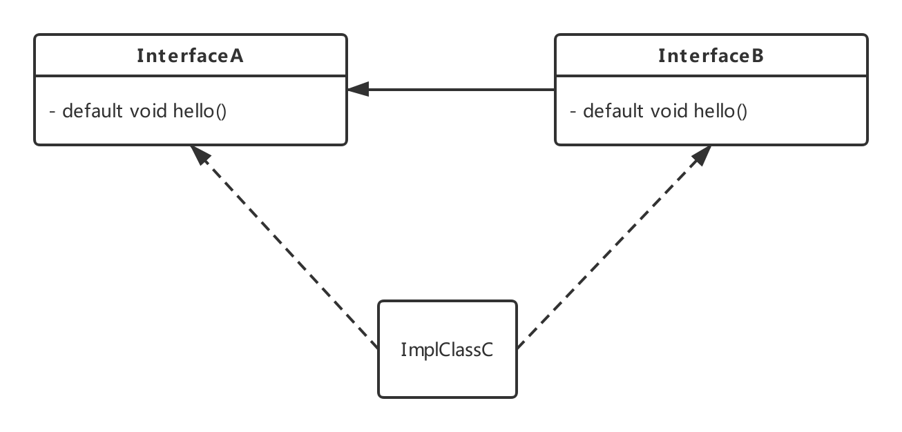
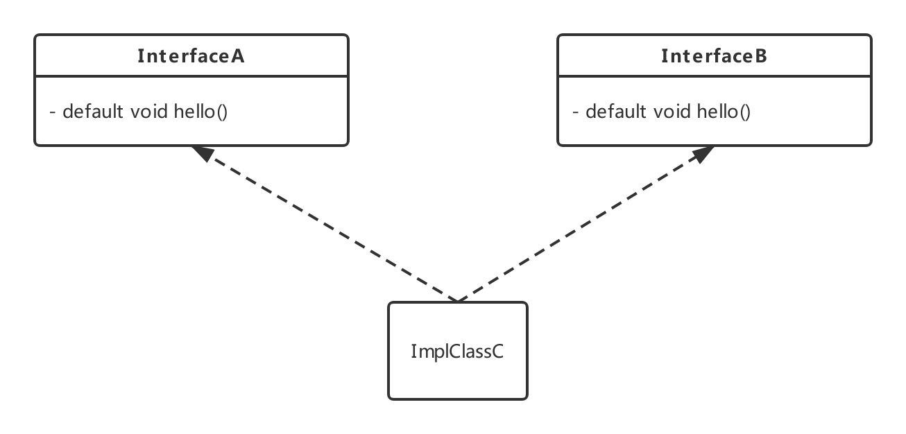
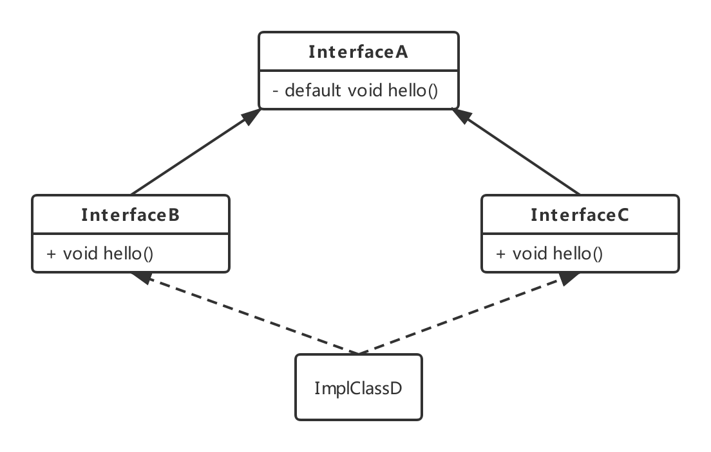

## 第八章：重构、测试和调试
### 1. 为改善可读性和灵活性重构代码
如果方向错了，停下来就是前进。

看完老员工留下来的代码，无力吐槽。如果以系统稳定可用为原则，不去改善代码可维护性，那等到将来需求变动需要修改时，对我们这些底层码农来说简直是一种折磨。欠下的技术债迟早是要还的。

#### 1.1 从匿名类到Lambda表达式的转换
匿名类和Lambda表达式中的`this`含义是不同的。在匿名类中，this指代的是匿名类本身。但是在Lambda中，`this`指代的是包含Lambda表达式的类。

匿名类可以屏蔽包含类的变量，而Lambda表达式不能（编译都不能通过），例如：
```
public void testAnonymityToLambda() {
    int a = 10;
    Runnable r1 = () -> {
        // 再次定义a变量会报错
        // int a = 1;
        System.out.println(a);
    };
    Runnable r2 = new Runnable() {
        @Override
        public void run() {
            int a = 2;
            System.out.println(a);
        }
    };
}
```

#### 1.2 使用Lambda重构设计模式
Lambda表达式为解决传统设计模式所面对的问题提供了新的解决方案。使用Lambda表达式后， 很多现存的略显臃肿的面向对象设计模式能够用更精简的方式实现了。
例如：
- 策略模式
- 模板方法设计模式
- 责任链模式
- 工厂模式

### 2. 测试Lambda表达式
使用Stream接口提供的`peek`方法可查看流水线中每个操作的中间状态，方便调试排错。

```
public static void testPeek() {
    List<Integer> nums = Arrays.asList(1, 2, 3, 4, 5, 6, 7);
    nums.stream()
            .peek(x -> System.out.println("before map" + x))
            .map(x -> x + 17)
            .peek(x -> System.out.println("before filter" + x))
            .filter(x -> x % 2 == 0)
            .peek(x -> System.out.println("before limit" + x))
            .limit(3)
            .peek(x -> System.out.println("before collect" + x))
            .collect(Collectors.toList())
            .forEach(System.out::println);
}
```

## 第九章：默认方法

先来回顾一下接口的相关知识。

### 接口

使用`interface`关键字声明，访问修饰符可以为`public`和默认（不写）；同时可以使用`abstract`关键字修饰，因为接口可以理解成一种完全抽象。使用`abstract`关键字编译器会让你通过编译，但一般没有人这样做。

#### Java 8 前

- 接口中的成员变量的修饰符全部默认为`public static final`，也可以不是静态`static`的，但一般没有人这样做。
- 接口中的方法只能是抽象方法。
- 接口中方法的修饰符全部默认为`public abstract`。

#### Java 8 后

- 接口中新增默认方法--使用`default`关键字声明。
- 接口中可以声明静态方法。

### 为什么要有默认方法？
如果原来的接口已经被很多人使用了，现在要在原来的接口中新增一个方法，在Java 8之前，所有的实现类都需要去显式实现这个方法，会造成很多不必要的麻烦，也许有些实现类根本就不需要用到新增的这个方法，反而需要强制在代码中写一个显式的空实现。正是由于这个原因，Java 8提供了默认方法，接口中新增的方法使用`default`关键字修饰，就可以在接口中提供一个默认实现，实现类不再需要强制显式实现这个新增方法。这个新特性主要是面向类库开发者。

### 默认方法引发的多实现冲突问题
一个类只能继承一个父类，但是可以实现多个接口。由于出现了默认方法，当一个类有多个实现时可能会出现方法继承冲突的问题。

### 解决问题的三个原则
- 类中的方法优先级最高。类或父类中声明的方法的优先级高于任何声明为默认方法的优先级。

- 如果无法依据第一条进行判断，那么子接口的优先级更高：函数签名相同时，优先选择拥有最具体实现的默认方法的接口，即如果B继承了A，那么B就比A更加具体。

- 最后，如果还是无法判断，继承了多个接口的类必须通过显式覆盖和调用期望的方法，显式地选择使用哪一个默认方法的实现。

### 冲突情况分析
#### 情形一
- 接口`InterfaceA`中定义了默认方法`hello`。
- 接口`InterfaceB`继承了接口`InterfaceA`，同时提供自己的默认`hello`方法。
- 实现类`ImplClassC`实现`InterfaceA`接口和`InterfaceB`接口，没有显式实现`hello`方法。



接口`InterfaceB`继承了`InterfaceA`，接口`InterfaceB`中的`hello`方法更具体，所以实现类`ImplClassC`拥有的是`InterfaceB`接口中的`hello`方法。

#### 情形二
- 接口`InterfaceA`中定义了默认方法`hello`。
- 接口`InterfaceB`继承了接口`InterfaceA`，同时提供自己的默认`hello`方法。
- 实现类`ImplClassD`实现`InterfaceA`接口，未显式重写接口的`hello`方法。
- 实现类`ImplClassC`继承`ImplClassD`类，同时实现`InterfaceA`和`InterfaceB`接口，没有显式实现`hello`方法。


`ImplClassC`和`ImplClassD`类中都未实现`hello`方法，`InterfaceB`继承`InterfaceA`接口，所以`InterfaceB`接口中的方法更具体，所以`ImplClassC`类具有的是`InterfaceB`中的`hello`方法。

#### 情形三
- 接口`InterfaceA`中定义了默认方法`hello`。
- 接口`InterfaceB`继承了接口`InterfaceA`，同时提供自己的默认`hello`方法。
- 实现类`ImplClassD`实现了`InterfaceA`接口，并显式重写了接口的`hello`方法。
- 实现类`ImplClassC`继承了`ImplClassD`实现类，并实现了`InterfaceA`和`InterfaceB`接口，没有显式实现`hello`方法。


`ImplClassC`和`ImplClassD`类中都未实现`hello`方法，`InterfaceB`继承`InterfaceA`接口，所以`InterfaceB`接口中的方法更具体，所以`ImplClassC`类具有的是`InterfaceB`中的`hello`方法。

#### 情形四
- 接口`InterfaceA`中定义了默认方法`hello`。
- 接口`InterfaceB`中定义了默认方法`hello`，未继承。
- 实现类`ImplClassC`实现`InterfaceA`和`InterfaceB`接口。



如果实现类`ImplClassC`不重写`hello`方法，编译器会抛出编译错误：
`ImplClassC inherits unrelated defaults for hello() from types InterfaceA and InterfaceB`。

可以直接在实现类中重新写一个`hello`方法的实现，也可以使用`super`关键字调用父接口的默认实现。

#### 情形五
- 接口`InterfaceA`中定义了默认方法`hello`。
- 接口`InterfaceB`继承了接口`InterfaceA`，未提供任何方法。
- 接口`InterfaceC`继承了接口`InterfaceA`，未提供任何方法。
- 实现类`ImplClassD`实现`InterfaceB`和`InterfaceC`接口。



`InterfaceB`和`InterfaceC`接口中都没有`hello`实现，它们的父接口`InterfaceA`中才有`hello`的默认实现，所以实现类`ImplClassD`拥有接口`InterfaceA`中`hello`方法。

#### 情形五扩展
如果`InterfaceB`中也提供`hello`默认实现，根据规则第二点，编译器会选择`InterfaceB`中声明的默认方法。

如果`InterfaceB`和`InterfaceC`都提供`hello`默认实现，就会出现冲突，`ImplClassD`实现类必须实现`hello`方法。

如果`InterfaceC`接口中添加非默认抽象方法`hello`，那么它比继承`InterfaceA`接口而来的`hello`优先级高，此时实现类`ImplClassD`必须显式实现`InterfaceC`的`hello`抽象方法。