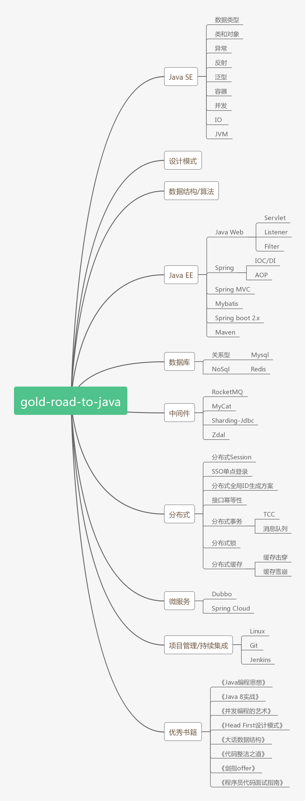

    
      
    一把为你遮风挡雨的伞🌻。
      
    
    
    
    

 

## 简介
gold-road-to-Java 是一条通往Java的黄金道路  ----  Java成魔之路。

本项目包含Java成魔的必备知识，内容来源于平时学习和工作中的积累沉淀。

才疏学浅，难免有错误和不足之处，欢迎指正，万分感谢。（建议使用PC端打开）

## Java成魔脑图
完善中...

  
没有行动的梦想都是妄想。
  

| Java SE | 算 法 | Java EE | 数据库 | 中间件 | 分布式 | 微服务 | 项目管理/持续集成 | 优秀书籍 |
| :--------: | :--------: | :--------: | :--------: | :--------: | :--------: | :--------: | :--------: | :--------: |
| [:coffee:](#coffee-JavaSE) | [:pencil:](#pencil-算法) | [:baby_bottle:](#baby_bottle-JavaEE) | [:package:](#package-数据库) | [:mailbox:](#mailbox-中间件) | [:globe_with_meridians:](#globe_with_meridians-分布式) | [:cloud:](#cloud-微服务) | [:octocat:](#octocat-项目管理-持续集成) | [:books:](#books-优秀书籍) |

## :coffee: [JavaSE](./JavaSE)
- [数据类型](./JavaSE/docs/数据类型.md)
- [类和对象](./JavaSE/docs/类和对象.md)
- [异常](./JavaSE/docs/异常.md)
- [反射](./JavaSE/docs/反射.md)
- [泛型](./JavaSE/docs/泛型.md)
- [容器](./JavaSE/docs/容器.md)
- [并发](./JavaSE/docs/并发.md)
- [IO](./JavaSE/docs/IO.md)
- [JVM](./JavaSE/docs/JVM.md)

## :pencil: [算法](./算法)

#### [LeetCode题解](./算法/LeetCode题解/README.md)
- [（简单）两数之和](./算法/LeetCode题解/docs/（简单）两数之和.md)

待完善...

## :baby_bottle: [JavaEE](./JavaEE)
待完善...

## :package: [数据库](./数据库)
#### [Redis](./数据库/Redis/README.md)
- [String字符串](./数据库/Redis/String字符串.md)
- [List列表](./数据库/Redis/List列表.md)
- [Hash哈希](./数据库/Redis/Hash哈希.md)
- [Set集合](./数据库/Redis/Set集合.md)
- [ZSet集合](./数据库/Redis/ZSet集合.md)
- [Redis集群配置](./数据库/Redis/Redis集群配置.md)
- [通用Redis命令](./数据库/Redis/通用Redis命令.md)
- [Redis扩展知识](./数据库/Redis/Redis扩展知识.md)
- [其它Redis服务器命令](./数据库/Redis/其它Redis服务器命令.md)

## :mailbox: [中间件](./中间件)
待完善...

## :globe_with_meridians: [分布式](./分布式)
待完善...

## :cloud: [微服务](./微服务)
待完善...

## :octocat: [项目管理-持续集成](./项目管理-持续集成)
#### Linux
- [Linux命令](./项目管理-持续集成/Linux/Linux命令.md)

#### Git
待完善...

#### Jenkins
待完善...

## :books: [优秀书籍](./Book-Notes)
- [Java 8实战](./Book-Notes/Java8实战/README.md)
  - [第一章：Java 8的前世今生](./Book-Notes/Java8实战/notes/第1章-Java8的前世今生.md)
  - [第二章：通过行为参数化传递代码](./Book-Notes/Java8实战/notes/第2章-通过行为参数化传递代码.md)
  - [第三章：Lambda表达式](./Book-Notes/Java8实战/notes/第3章-Lambda表达式.md)
  - [第四章：引入流](./Book-Notes/Java8实战/notes/第4章-引入流.md)
  - [第五章：使用流](./Book-Notes/Java8实战/notes/第5章-使用流.md)
  - [第六章：用流收集数据](./Book-Notes/Java8实战/notes/第6章-用流收集数据.md)
  - [第七章：并行数据处理与性能](./Book-Notes/Java8实战/notes/第7章-并行数据处理与性能.md)
  - [第八章：重构、测试和调试](./Book-Notes/Java8实战/notes/第8章-重构-测试-调试.md)
  - [第九章：默认方法](./Book-Notes/Java8实战/notes/第9章-默认方法.md)
  - [第十章：用Optional取代null](./Book-Notes/Java8实战/notes/第10章-用Optional取代null.md)

待完善...

- [《剑指Offer》](./Book-Notes/剑指Offer/README.md)
  - [实现线程安全的单例模式](./Book-Notes/剑指Offer/docs/实现线程安全的单例模式.md)
  - [数组中重复的数（题目一）](./Book-Notes/剑指Offer/docs/数组中重复的数（题目一）.md)
  - [数组中重复的数（题目二）](./Book-Notes/剑指Offer/docs/数组中重复的数（题目二）.md)
  - [二维数组中的查找](./Book-Notes/剑指Offer/docs/二维数组中的查找.md)
  - [替换空格](./Book-Notes/剑指Offer/docs/替换空格.md)
  - [面试题5（相关题目）](./Book-Notes/剑指Offer/docs/面试题5（相关题目）.md)
  - [从尾到头打印链表](./Book-Notes/剑指Offer/docs/从尾到头打印链表.md)
  - [重建二叉树](./Book-Notes/剑指Offer/docs/重建二叉树.md)
  - [二叉树的下一个节点](./Book-Notes/剑指Offer/docs/二叉树的下一个节点.md)
  - [两个栈实现一个队列](./Book-Notes/剑指Offer/docs/两个栈实现一个队列.md)
  - [两个队列实现一个栈](./Book-Notes/剑指Offer/docs/两个队列实现一个栈.md)
  - [斐波那楔数列](./Book-Notes/剑指Offer/docs/斐波那楔数列.md)
  - [青蛙跳台阶问题](./Book-Notes/剑指Offer/docs/青蛙跳台阶问题.md)
  - [青蛙跳台阶问题扩展（变态跳台阶）](./Book-Notes/剑指Offer/docs/青蛙跳台阶问题扩展（变态跳台阶）.md)
  - [矩形覆盖](./Book-Notes/剑指Offer/docs/矩形覆盖.md)
  - [几万个员工年龄排序](./Book-Notes/剑指Offer/docs/几万个员工年龄排序.md)
  - [旋转数组的最小数字](./Book-Notes/剑指Offer/docs/旋转数组的最小数字.md)
  - [矩阵中的路径](./Book-Notes/剑指Offer/docs/矩阵中的路径.md)
  - [机器人的运动范围](./Book-Notes/剑指Offer/docs/机器人的运动范围.md)
  - [剪绳子](./Book-Notes/剑指Offer/docs/剪绳子.md)
  - [二进制中1的个数](./Book-Notes/剑指Offer/docs/二进制中1的个数.md)
  - [数值的整数次方](./Book-Notes/剑指Offer/docs/数值的整数次方.md)
  - [打印从1到最大的n位数](./Book-Notes/剑指Offer/docs/打印从1到最大的n位数.md)
  - [在O(1)时间内删除链表节点](./Book-Notes/剑指Offer/docs/在O(1)时间内删除链表节点.md)
  - [删除链表中重复的节点](./Book-Notes/剑指Offer/docs/删除链表中重复的节点.md)
  - [正则表达式匹配](./Book-Notes/剑指Offer/docs/正则表达式匹配.md)
  - [表示数值的字符串](./Book-Notes/剑指Offer/docs/表示数值的字符串.md)
  - [链表中倒数第k个节点](./Book-Notes/剑指Offer/docs/链表中倒数第k个节点.md)
  - [链表中环的入口节点](./Book-Notes/剑指Offer/docs/链表中环的入口节点.md)
  - [反转链表](./Book-Notes/剑指Offer/docs/反转链表.md)
  - [合并两个排序的链表](./Book-Notes/剑指Offer/docs/合并两个排序的链表.md)

待完善...

- [《程序员代码面试指南-IT名企算法和数据结构题目最优解》](./Book-Notes/程序员代码面试指南-IT名企算法和数据结构题目最优解/README.md)

待完善...