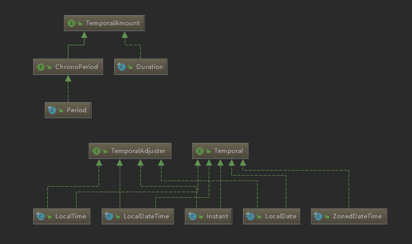
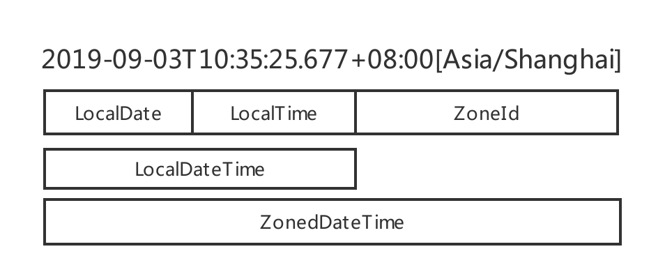

## 新的日期时间API

在Java 8之前，我们常用的日期时间API是`java.util.Date`和`java.util.Calendar`这两个类。

如果我们要构建一个指定年月日的日期时间对象，比如`2019-9-2`，使用`java.util.Date`类的构造方法`Date(int year, int month, int date)`，传入的年份year参数必须是年份2019减去1900，即传入119。每次创建对象前还需要先进行计算，很不方便。

JDK 1.1提供的`java.util.Calendar`类在使用时也有很多不方便的地方，比如对一个日期加两天，使用`add`方法，传入2；对一个日期减两天，也使用`add`方法，传入-2。还有一点是这个类默认每周第一天是周日。使用起来也有点不方便。

归根到底，JDK1.8之前的日期时间API都是可变的，是线程不安全的。

另外，对时间日期进行格式化的类`SimpleDateFormat`在`java.text`包下，该类的定义位置不规范。它也是线程不安全的。

而在Java 8中，时间格式转化器是`java.time.format.DateTimeFormatter`类，它被声明为`final`，是不可变的类，线程安全。

另外，Java 8中提供的新日期时间API包含两类：一个是为了便于人阅读使用，包含`LocalDate`、`LocalTime`、`LocalDateTime`这三个类，它们都是用`final`修饰的类，是不可变的对象，分别表示`ISO-8601`日历系统中的日期、时间、日期和时间。另外一个是便于机器处理的类，`Instant`：用来表示机器的日期和时间格式：时间戳。

> ISO-8601日历系统：是国际标准化组织制定的现代公民的日期和时间的表示法。
> 时间戳：从UNIX元年：1970年1月1日 00:00:00到某个时间之间的毫秒值。

#### 传统时间格式转换器SimpleDateFormat线程安全问题演示
当多个线程同时操作同一个`SimpleDateFormat`对象时，就会出现线程安全问题。

演示代码：
```
    public static void main(String[] args) {
        SimpleDateFormat sdf = new SimpleDateFormat("yyyy-MM-dd");
        // 使用线程池模拟多线程
        ExecutorService threadPool = Executors.newFixedThreadPool(10);
        // 定义解析日期字符串任务：使用SimpleDateFormat对象解析
        Callable<Date> task = () -> sdf.parse("2019-8-29");
        // 存储结果容器
        List<Future<Date>> result = new ArrayList<>();
        for (int i = 0; i < 10; i++) {
            // 执行得到解析结果
            result.add(threadPool.submit(task));
        }
        // 遍历输出
        for (Future<Date> r : result) {
            System.out.println(r.get());
        }
        threadPool.shutdown();
    }
```

异常信息如下：
```
Exception in thread "main" java.util.concurrent.ExecutionException: java.lang.NumberFormatException: multiple points
```

解决方法：
1、将`SimpleDateFormat`定义为方法内的局部变量，且方法中没有多线程的操作。
2、使用`ThreadLocal`进行线程封闭。为每个线程保存一个`SimpleDateFormat`对象。

#### 传统时间格式转换器线程安全问题解决方案：使用ThreadLocal进行线程封闭
线程封闭类代码：
```
package cn.org.lilu.chapter12;

import java.text.DateFormat;
import java.text.SimpleDateFormat;
import java.util.Date;

/**
 * @author sunchaser
 * @since JDK8 2019/8/29
 * 传统时间格式转换器线程安全问题解决方案：使用ThreadLocal进行线程封闭
 */
public class TraditionalSimpleDateFormatThreadLocal {
    private static final ThreadLocal<DateFormat> threadLocal = new ThreadLocal<DateFormat>() {
        @Override
        protected DateFormat initialValue() {
            return new SimpleDateFormat("yyyy-MM-dd");
        }
    };

    public static Date convert(String source) throws Exception {
        return threadLocal.get().parse(source);
    }
}
```

演示代码：
```
    public static void main(String[] args) throws Exception {
        // 使用线程池模拟多线程
        ExecutorService threadPool = Executors.newFixedThreadPool(10);
        // 定义解析日期字符串任务：每个任务都有一份SimpleDateFormat对象的副本
        Callable<Date> task = () -> TraditionalSimpleDateFormatThreadLocal.convert("2019-8-29");
        // 解析结果容器
        List<Future<Date>> result = new ArrayList<>();
        for (int i = 0; i < 10; i++) {
            // 执行得到解析结果
            result.add(threadPool.submit(task));
        }
        // 遍历输出
        for (Future<Date> r : result) {
            System.out.println(r.get());
        }
        threadPool.shutdown();
    }
```
运行结果正常。

#### Java 8新的时间格式转化器DateTimeFormatter
`DateTimeFormatter`类定义在`java.time.format`包下，且声明为`final`类，不可变，线程安全。

代码演示：
```
    public static void main(String[] args) throws Exception {
        // 按照哪种格式进行格式转换
        // DateTimeFormatter dtf = DateTimeFormatter.ISO_LOCAL_DATE;
        DateTimeFormatter dtf = DateTimeFormatter.ofPattern("yyyyMMdd");
        // LocalDate.parse("20190829",dtf)：将第一个字符串参数按照第二个参数定义的格式器解析，返回一个LocalDate对象
        Callable<LocalDate> task = () -> LocalDate.parse("20190829",dtf);
        ExecutorService threadPool = Executors.newFixedThreadPool(10);
        List<Future<LocalDate>> result = new ArrayList<>();
        for (int i = 0; i < 10; i++) {
            result.add(threadPool.submit(task));
        }
        // 遍历输出
        for (Future<LocalDate> r : result) {
            System.out.println(r.get());
        }
        threadPool.shutdown();
    }
```

#### Java 8日期时间API：LocalDate、LocalTime、LocalDateTime
这三个类的用法几乎一样，`LocalDate`表示日期，`LocalTime`表示时间，`LocalDateTime`包含前两者，表示日期和时间。

可由前两个类组合出第三个类，也可由第三个类提取出前两个类。

##### 年月日对象：LocalDate
可使用静态工厂方法`now`获取当前日期；

可使用静态工厂方法`of`创建一个`LocalDate`日期对象，可从一个`LocalDate`日期对象中获取该日期的年份、月份、这个月的第几天、这周的星期几、今年的第几天、这个月的长度（有几天）和是否为闰年等信息。

代码演示：
```
    /**
     * LocalDate：年月日
     */
    @Test
    public void testLocalDate() {
        // 静态工厂方法now获取当前日期
        LocalDate now = LocalDate.now();
        // 静态工厂方法of创建一个LocalDate实例
        LocalDate date = LocalDate.of(2019,8,26);
        // 年份
        int year = date.getYear();
        // 月份
        Month month = date.getMonth();
        // 这个月第几天
        int dayOfMonth = date.getDayOfMonth();
        // 这周星期几
        DayOfWeek dayOfWeek = date.getDayOfWeek();
        // 今年第几天
        int dayOfYear = date.getDayOfYear();
        // 这个月的长度（有几天）
        int lengthOfMonth = date.lengthOfMonth();
        // 是否闰年
        boolean leapYear = date.isLeapYear();
        System.out.println(now); // 2019-09-02
        System.out.println(year); // 2019
        System.out.println(month); // AUGUST
        System.out.println(dayOfMonth); // 26
        System.out.println(dayOfWeek); // MONDAY
        System.out.println(dayOfYear); // 238
        System.out.println(lengthOfMonth); // 31
        System.out.println(leapYear); // false
    }
```

##### 时分秒对象：LocalTime
可使用静态工厂方法`now`获取当前时间的时分秒（包含纳秒）。

可使用静态工厂方法`of`创建一个`LocalTime`时间对象，可从一个`LocalTime`时间对象中获取该时间的时、分、秒和纳秒等信息。

`of`方法包含三个重载，方法签名如下：
```
/**
 * @param hour  the hour-of-day to represent, from 0 to 23
 * @param minute  the minute-of-hour to represent, from 0 to 59
 */
public static LocalTime of(int hour, int minute);

/**
 * @param hour  the hour-of-day to represent, from 0 to 23
 * @param minute  the minute-of-hour to represent, from 0 to 59
 * @param second  the second-of-minute to represent, from 0 to 59
 */
public static LocalTime of(int hour, int minute, int second);

/**
 * @param hour  the hour-of-day to represent, from 0 to 23
 * @param minute  the minute-of-hour to represent, from 0 to 59
 * @param second  the second-of-minute to represent, from 0 to 59
 * @param nanoOfSecond  the nano-of-second to represent, from 0 to 999,999,999
 */
public static LocalTime of(int hour, int minute, int second, int nanoOfSecond);
```

使用代码示例：
```
    /**
     * LocalTime：时分秒
     * 一天中的时间，比如：13:45:20，可以使用LocalTime类表示
     * 可以使用of重载的三个静态工厂方法创建LocalTime实例
     * 第一个重载方法接收小时和分钟
     * 第二个重载方法同时还接收秒
     * 第三个重载方法同时还接收纳秒
     */
    @Test
    public void testLocalTime() {
        LocalTime now = LocalTime.now();
        LocalTime localTime = LocalTime.of(13, 45, 20,1);
        int hour = localTime.getHour();
        int minute = localTime.getMinute();
        int second = localTime.getSecond();
        int nano = localTime.getNano();
        System.out.println(now); // 19:47:51.212
        System.out.println(hour); // 13
        System.out.println(minute); // 45
        System.out.println(second); // 20
        System.out.println(nano); // 1
    }
```
##### 日期时间字符串解析
LocalDate和LocalTime都可以通过解析代表它们的字符串创建。使用静态方法parse。一旦传递的字符串参数无法被解析为合法的LocalDate或LocalTime对象，这两个parse方法都会抛出一个继承自RuntimeException的DateTimeParseException异常。

代码示例：
```
    /**
     * LocalDate和LocalTime都可以通过解析代表它们的字符串创建。使用静态方法parse。
     * 一旦传递的字符串参数无法被解析为合法的LocalDate或LocalTime对象，
     * 这两个parse方法都会抛出一个继承自RuntimeException的DateTimeParseException异常。
     */
    @Test
    public void testParse() {
        // 小于10的必须在前面补0，否则抛出异常
        LocalDate localDate = LocalDate.parse("2019-08-26");
        LocalTime localTime = LocalTime.parse("13:45:20");
        System.out.println(localDate);
        System.out.println(localTime);
    }
```

##### 年月日时分秒对象：LocalDateTime
可使用静态工厂方法`now`获取当前时间的年月日时分秒纳秒；

可使用静态工厂方法`of`创建一个`LocalDateTime`日期时间对象；

可由`LocalDate`和`LocalTime`组合出`LocalDateTime`对象；

可从`LocalDateTime`对象中提取出`LocalDate`和`LocalTime`。

代码示例：
```
    /**
     * LocalDateTime：年月日时分秒
     */
    @Test
    public void testLocalDateTime() {
        LocalDateTime localDateTime = LocalDateTime.now();
        LocalDateTime localDateTime1 = LocalDateTime.of(2019, Month.AUGUST, 26, 10, 47, 20);
        LocalDate localDate = LocalDate.now();
        LocalTime localTime = LocalTime.now();
        // 由LocalDate和LocalTime组合出LocalDateTime
        LocalDateTime localDateTime2 = LocalDateTime.of(localDate,localTime);
        LocalDateTime localDateTime3 = localDate.atTime(10,51,32);
        LocalDateTime localDateTime4 = localDate.atTime(localTime);
        LocalDateTime localDateTime5 = localTime.atDate(localDate);
        // 由LocalDateTime提取出LocalDate和LocalTime
        LocalDate localDateFromLocalDateTime = localDateTime2.toLocalDate();
        LocalTime localTimeFromLocalDateTime = localDateTime2.toLocalTime();

        System.out.println(localDateTime); // 2019-09-02T19:57:16.516
        System.out.println(localDateTime1); // 2019-08-26T10:47:20
        System.out.println(localDateTime2); // 2019-09-02T19:57:16.517
        System.out.println(localDateTime3); // 2019-09-02T10:51:32
        System.out.println(localDateTime4); // 2019-09-02T19:57:16.517
        System.out.println(localDateTime5); // 2019-09-02T19:57:16.517
        System.out.println(localDateFromLocalDateTime); // 2019-09-02
        System.out.println(localTimeFromLocalDateTime); // 19:57:16.517
    }
```

#### 时间戳对象：Instant
机器的日期和时间格式：从UNIX元年时间开始到现在所经过的秒数对时间进行建模。包含的是由秒及纳秒组成的数字。

使用静态工厂方法`now`获取当前时刻的时间戳，默认获取的是UTC时区（世界协调时间）所在的时刻，可做时区偏移运算获取带偏移量的日期时间对象`OffsetDateTime`。可使用`toEpochMilli`方法获取表示的时间戳秒数。

可使用静态工厂方法`ofEpochSecond`等对时间戳进行运算。

`Instant`的设计初衷是为了便于机器使用。它包含的是由秒及纳秒所构成的数字。所以，它无法处理那些我们非常容易理解的时间单位。比如下面这行代码：
```
int day = Instant.now().get(ChronoField.DAY_OF_MONTH);
```
它会抛出如下异常：
```
java.time.temporal.UnsupportedTemporalTypeException: Unsupported field: DayOfMonth
```

示例代码：
```
    /**
     * Instant：从UNIX元年时间开始到现在所经过的秒数对时间进行建模。包含的是由秒及纳秒组成的数字。
     *
     * 静态工厂方法：ofEpochSecond包含两个重载版本
     * // 传入一个代表秒数的值创建一个Instant实例
     * Instant ofEpochSecond(long epochSecond)
     * // 第一个参数：代表秒数的值，第二个参数：纳秒数，对第一个参数传入的秒数进行调整，确保保存的纳秒分片在0到999 999 999之间。
     * Instant ofEpochSecond(long epochSecond, long nanoAdjustment)
     *
     * 静态工厂方法：now
     */
    @Test
    public void testInstant() {
        Instant instant1 = Instant.ofEpochSecond(3);
        Instant instant2 = Instant.ofEpochSecond(3, 0);
        Instant instant3 = Instant.ofEpochSecond(2, 1_000_000_000);
        Instant instant4 = Instant.ofEpochSecond(4, -1_000_000_000);
        System.out.println(instant1);
        System.out.println(instant2);
        System.out.println(instant3);
        System.out.println(instant4);

        Instant now = Instant.now(); // 默认获取UTC时区的时间
        System.out.println(now);
        // 时区偏移运算：获取偏移8小时的时区的时间。OffsetDateTime：带偏移量的日期时间对象
        OffsetDateTime offsetDateTime = now.atOffset(ZoneOffset.ofHours(8));
        System.out.println(offsetDateTime);
        // 转化成时间戳
        System.out.println(now.toEpochMilli());
        // java.time.temporal.UnsupportedTemporalTypeException: Unsupported field: DayOfMonth
        int day = now.get(ChronoField.DAY_OF_MONTH);
        System.out.println(day);
    }
```

#### 计算两个时间之间的间隔：Duration 和计算两个日期之间的间隔：Period
可以使用`Duration`类的静态方法`between`计算两个时间点之间的间隔，`between`方法接收的参数是两个`Temporal`对象，虽然`LocalDateTime`和`Instant`都是`Temporal`接口的实现类，但是它们是为不同的目的而设计的，一个是为了便于人阅读使用， 另一个是为了便于机器处理，所以我们不能将它们混用，即不能计算`LocalDateTime`和`Instant`对象之间的间隔。

可以使用`Period`类的静态方法`between`计算两个日期之间的间隔。

也可使用静态工厂方法直接创建`Duration`和`Period`类的对象。

示例代码：
```
    /**
     * 计算两个时间之间的间隔：Duration
     * 计算两个日期之间的间隔：Period
     */
    @Test
    public void testDuration() throws Exception {
        LocalTime localTime1 = LocalTime.parse("13:45:20");
        LocalTime localTime2 = LocalTime.parse("13:45:30");
        LocalDateTime localDateTime1 = LocalDateTime.now();
        Thread.sleep(100);
        LocalDateTime localDateTime2 = LocalDateTime.now();
        Instant instant1 = Instant.ofEpochSecond(3);
        Instant instant2 = Instant.ofEpochSecond(6);
        System.out.println(Duration.between(localTime1,localTime2)); // PT10S
        System.out.println(Duration.between(localDateTime1,localDateTime2)); // PT0.1S
        System.out.println(Duration.between(instant1,instant2)); // PT3S

        // 计算两个LocalDate之间的时长
        Period periodBetween = Period.between(LocalDate.of(2019, 8, 26), LocalDate.of(2019, 8, 28));
        System.out.println(periodBetween); // P1D
        System.out.println(periodBetween.getDays()); // 2

        // Duration和Period的静态工厂方法直接创建实例
        Duration durationOfMinutes = Duration.ofMinutes(3);
        Duration durationOf = Duration.of(3, ChronoUnit.MINUTES);
        Period periodOfDays = Period.ofDays(10);
        Period periodOfWeeks = Period.ofWeeks(3);
        Period periodOf = Period.of(2, 6, 1);
        System.out.println(durationOfMinutes); // PT3M
        System.out.println(durationOf); // PT3M
        System.out.println(periodOfDays); // P10D
        System.out.println(periodOfWeeks); // P21D
        System.out.println(periodOf); // P2Y6M1D
    }
```

#### 操作、解析和格式化日期
`LocalDate`、`LocalTime`、`LocalDateTime`以及`Instant`这样表示时间点的日期-时间类提供了很多通用的方法用来操作日期-时间。所有的方法都返回一个修改了属性的对象。它们都不会修改原来的对象。

最直接也最简单的方法是使用"`withAttribute`"方法。"`withAttribute`"方法会创建对象的一个副本，并按照需要修改它的属性。

也可使用通用的`with`方法，它接受的第一个参数是一个`TemporalField`对象，第二个参数是需要修改的值。

`with`方法还有一个重载的方法，它接收一个日期调整器`TemporalAdjuster`对象，更加灵活地处理日期。

代码示例：
```
    /**
     * 操纵、解析和格式化日期
     *
     * LocalDate、LocalTime和LocalDateTime类都为final类，不可变，每次操作后都返回一个新的对应对象
     */
    @Test
    public void testUpdateTime() {
        LocalDate date1 = LocalDate.of(2019, 8, 26);
        LocalDate date2 = date1.withYear(2020);
        LocalDate date3 = date2.withDayOfMonth(25);
        LocalDate date4 = date3.with(ChronoField.MONTH_OF_YEAR, 9);
        System.out.println(date1); // 2019-08-26
        System.out.println(date2); // 2020-08-26
        System.out.println(date3); // 2020-08-25
        System.out.println(date4); // 2020-09-25

        LocalDate date5 = LocalDate.of(2019,8,26);
        LocalDate date6 = date5.plusWeeks(1); // 加一周
        LocalDate date7 = date6.minusYears(3); // 减三年
        LocalDate date8 = date7.plus(6, ChronoUnit.MONTHS); // 加六月
        System.out.println(date5); // 2019-08-26
        System.out.println(date6); // 2019-09-02
        System.out.println(date7); // 2016-09-02
        System.out.println(date8); // 2017-03-02
    }
```

##### 日期调整器：TemporalAdjuster
`TemporalAdjuster`是一个函数式接口，接口方法签名如下：
```
Temporal adjustInto(Temporal temporal);
```
接收一个`Temporal`对象，返回一个`Temporal`对象。由于所有的日期时间API都实现了`Temporal`接口，故它可以用来自定义更加复杂的日期时间操作。

Java 8提供了`TemporalAdjusters`类，该类通过静态方法提供了大量的常用`TemporalAdjuster`的实现。

同时还支持定制`TemporalAdjuster`，定制的方式有两种：

一：实现`TemporalAdjuster`接口；

二：使用Lambda表达式定制`TemporalAdjuster`对象，推荐使用`TemporalAdjusters`类的静态工厂方法`ofDateAdjuster`，该方法签名如下：
```
public static TemporalAdjuster ofDateAdjuster(UnaryOperator<LocalDate> dateBasedAdjuster)
```
接收一个`UnaryOperator`函数式接口，返回一个`TemporalAdjuster`对象。

`UnaryOperator`函数式接口中方法签名如下，它总是返回它的输入。
```
    static <T> UnaryOperator<T> identity() {
        return t -> t;
    }
```


相关代码示例如下：

```
    /**
     * 日期调整器
     */
    @Test
    public void testTemporalAdjuster() {
        LocalDate date1 = LocalDate.of(2019,8,26);
        // TemporalAdjuster dayOfWeekInMonth(int ordinal, DayOfWeek dayOfWeek)
        // dayOfWeek表示星期几
        // 如果ordinal为0，则表示本日期所在的月的上一个月的最后一个星期几
        // 如果ordinal为正数，则以本日期所在的月从前向后数，第ordinal个星期几
        // 如果ordinal为负数，则以本日期所在的月从后往前数，第-ordinal个星期几
        LocalDate date2 = date1.with(TemporalAdjusters.dayOfWeekInMonth(1, DayOfWeek.FRIDAY));
        System.out.println("date2=" + date2);

        // TemporalAdjuster firstDayOfMonth()：创建一个新的日期，它的值为当月的第一天
        LocalDate date3 = date1.with(TemporalAdjusters.firstDayOfMonth());
        System.out.println("date3=" + date3);

        // TemporalAdjuster firstDayOfNextMonth()：创建一个新的日期，它的值为下月的第一天
        LocalDate date4 = date1.with(TemporalAdjusters.firstDayOfNextMonth());
        System.out.println("date4=" + date4);

        // TemporalAdjuster firstDayOfNextYear()：创建一个新的日期，它的值为明年的第一天
        LocalDate date5 = date1.with(TemporalAdjusters.firstDayOfNextYear());
        System.out.println("date5=" + date5);

        // TemporalAdjuster firstDayOfYear()：创建一个新的日期，它的值为今年的第一天
        LocalDate date6 = date1.with(TemporalAdjusters.firstDayOfYear());
        System.out.println("date6=" + date6);

        // TemporalAdjuster firstInMonth(DayOfWeek dayOfWeek)：创建一个新的日期，它的值为同一个月中，第一个符合星期几要求的日期（这个月的第一个星期几）
        LocalDate date7 = date1.with(TemporalAdjusters.firstInMonth(DayOfWeek.FRIDAY));
        System.out.println("date7=" + date7);

        // TemporalAdjuster lastDayOfMonth()：创建一个新的日期，它的值为这个月的最后一天
        LocalDate date8 = date1.with(TemporalAdjusters.lastDayOfMonth());
        System.out.println("date8=" + date8);

        // TemporalAdjuster lastDayOfYear()：创建一个新的日期，它的值为今年的最后一天
        LocalDate date9 = date1.with(TemporalAdjusters.lastDayOfYear());
        System.out.println("date9=" + date9);

        // TemporalAdjuster lastInMonth(DayOfWeek dayOfWeek)：创建一个新的日期，它的值为同一个月中，最后一个符合星期几要求的日期
        LocalDate date10 = date1.with(TemporalAdjusters.lastInMonth(DayOfWeek.FRIDAY));
        System.out.println("date10=" + date10);

        // TemporalAdjuster next(DayOfWeek dayOfWeek)：创建一个新的日期，并将其值设定为指定日期之后第一个符合指定星期几的日期
        LocalDate date11 = date1.with(TemporalAdjusters.next(DayOfWeek.MONDAY));
        System.out.println("date11=" + date11);

        // TemporalAdjuster nextOrSame(DayOfWeek dayOfWeek)：
        // 创建一个新的日期，并将其值设定为指定日期之后第一个符合指定星期几的日期；
        // 如果指定日期已符合要求，则直接返回该日期
        LocalDate date12 = date1.with(TemporalAdjusters.nextOrSame(DayOfWeek.MONDAY));
        System.out.println("date12=" + date12);

        // TemporalAdjuster previous(DayOfWeek dayOfWeek)：创建一个新的日期，并将其值设定为指定日期之前第一个符合指定星期几的日期
        LocalDate date13= date1.with(TemporalAdjusters.previous(DayOfWeek.MONDAY));
        System.out.println("date13=" + date13);

        // TemporalAdjuster previousOrSame(DayOfWeek dayOfWeek)：
        // 创建一个新的日期，并将其值设定为指定日期之前第一个符合指定星期几的日期；
        // 如果指定日期已符合要求，则直接返回该日期
        LocalDate date14 = date1.with(TemporalAdjusters.previousOrSame(DayOfWeek.MONDAY));
        System.out.println("date14=" + date14);

        // 使用Lambda表达式定制TemporalAdjuster对象，推荐使用TemporalAdjusters类的静态工厂方法ofDateAdjuster
        // TemporalAdjuster ofDateAdjuster(UnaryOperator<LocalDate> dateBasedAdjuster)
        TemporalAdjuster nextWorkingDay = TemporalAdjusters.ofDateAdjuster(temporal -> {
            DayOfWeek dayOfWeek = DayOfWeek.of(temporal.get(ChronoField.DAY_OF_WEEK));
            int dayToAdd = 1;
            if (dayOfWeek == DayOfWeek.FRIDAY) dayToAdd = 3;
            else if (dayOfWeek == DayOfWeek.SATURDAY) dayToAdd = 2;
            return temporal.plus(dayToAdd,ChronoUnit.DAYS);
        });
    }
    
    /**
     * 定制TemporalAdjuster
     *
     * 计算下一个工作日
     */
    class NextWorkingDay implements TemporalAdjuster {

        /**
         * 周一到周五为工作日
         * 如果是周日到周四，则返回下一天
         * 如果是周五、周六、返回下周周一
         * @param temporal
         * @return
         */
        @Override
        public Temporal adjustInto(Temporal temporal) {
            // 得到今天星期几
            DayOfWeek dayOfWeek = DayOfWeek.of(temporal.get(ChronoField.DAY_OF_WEEK));
            int dayToAdd = 1;
            if (dayOfWeek == DayOfWeek.FRIDAY) dayToAdd = 3;
            else if (dayOfWeek == DayOfWeek.SATURDAY) dayToAdd = 2;
            return temporal.plus(dayToAdd,ChronoUnit.DAYS);
        }
    }
```

`TemporalAdjusters`类中包含的工厂方法列表：

| 方法签名 | 描述 |
|:----|:----|
| `TemporalAdjuster dayOfWeekInMonth(int ordinal, DayOfWeek dayOfWeek)` | dayOfWeek表示星期几<br />如果ordinal为0，则表示本日期所在的月的上一个月的最后一个星期几<br />如果ordinal为正数，则以本日期所在的月从前向后数，第ordinal个星期几<br /> 如果ordinal为负数，则以本日期所在的月从后往前数，第-ordinal个星期几|
| `TemporalAdjuster firstDayOfMonth()` | 创建一个新的日期，它的值为当月的第一天 |
| `TemporalAdjuster firstDayOfNextMonth()` | 创建一个新的日期，它的值为下月的第一天 |
| `TemporalAdjuster firstDayOfNextYear()` | 创建一个新的日期，它的值为明年的第一天 |
| `TemporalAdjuster firstDayOfYear()` | 创建一个新的日期，它的值为今年的第一天 |
| `TemporalAdjuster firstInMonth(DayOfWeek dayOfWeek)` | 创建一个新的日期，它的值为同一个月中，第一个符合星期几要求的日期（这个月的第一个星期几） |
| `TemporalAdjuster lastDayOfMonth()` | 创建一个新的日期，它的值为这个月的最后一天 |
| `TemporalAdjuster lastDayOfYear()` | 创建一个新的日期，它的值为今年的最后一天 |
| `TemporalAdjuster lastInMonth(DayOfWeek dayOfWeek)` | 创建一个新的日期，它的值为同一个月中，最后一个符合星期几要求的日期 |
| `TemporalAdjuster next(DayOfWeek dayOfWeek)` | 创建一个新的日期，并将其值设定为指定日期之后第一个符合指定星期几的日期 |
| `TemporalAdjuster nextOrSame(DayOfWeek dayOfWeek)` | 创建一个新的日期，并将其值设定为指定日期之后第一个符合指定星期几的日期；如果指定日期已符合要求，则直接返回该日期 |
| `TemporalAdjuster previous(DayOfWeek dayOfWeek)` | 创建一个新的日期，并将其值设定为指定日期之前第一个符合指定星期几的日期 |
| `TemporalAdjuster previousOrSame(DayOfWeek dayOfWeek)` | 创建一个新的日期，并将其值设定为指定日期之前第一个符合指定星期几的日期；如果指定日期已符合要求，则直接返回该日期 |

#### 时区
时区的处理是新版日期和时间API新增加的重要功能，使用新版日期和时间API时区的处理被极大地简化了。新的`java.time.ZoneId`类是老版`java.util.TimeZone`的替代品。它的设计目标就是要让你无需为时区处理的复杂和繁琐而操心，跟其他日期和时间类一 样，`ZoneId`类也是被`final`修饰而无法修改的。

代码示例：
```
    /**
     * 带时区的日期时间API
     */
    @Test
    public void testZoneLocalDateTime() {
        // 查看所有支持的时区
        Set<String> availableZoneIds = ZoneId.getAvailableZoneIds();
        for (String s: availableZoneIds) {
            System.out.println(s);
        }
        // 通过时区构建LocalDateTime对象
        LocalDateTime localDateTimeNow = LocalDateTime.now(ZoneId.of("Asia/Shanghai"));
        // 指定时区构建带时区的日期时间对象
        ZonedDateTime zonedDateTime = localDateTimeNow.atZone(ZoneId.of("Asia/Shanghai"));
        System.out.println(localDateTimeNow); // 2019-09-03T10:35:25.677
        // 2019-09-03T10:35:25.677+08:00[Asia/Shanghai] 与UTC时间相差8小时
        System.out.println(zonedDateTime);
    }
```

#### 日期时间API的部分UML图
以上介绍的新的日期时间API相关类的UML图如下：


下面这张图能帮助我们更好的理解LocaleDate、 LocalTime、LocalDateTime以及ZoneId之间的差异。


## 本章小结
- Java 8之前老版的java.util.Date类以及其他用于建模日期时间的类有很多不一致及设计上的缺陷，包括易变性以及糟糕的偏移值、默认值和命名。
- 新版的日期和时间API中，日期-时间对象是不可变的。
- 新的API提供了两种不同的时间表示方式，有效地区分了运行时人和机器的不同需求。
- 我们可以用绝对或者相对的方式操纵日期和时间，操作的结果总是返回一个新的实例，老的日期时间对象不会发生变化。
- TemporalAdjuster可以更精细的方式操纵日期，不再局限于一次只能改变它的一个值，并且我们还可按照需求定义自己的日期转换器。
- 我们现在可以按照特定的格式需求，定义自己的格式器，打印输出或者解析日期-时间对象。 这些格式器可以通过模板创建，也可以自己编程创建，最重要的是它们都是线程安全的。
- 可以用相对于某个地区/位置的方式，或者以与UTC/格林尼治时间的绝对偏差的方式表示时区，并将其应用到日期-时间对象上，对其进行本地化。