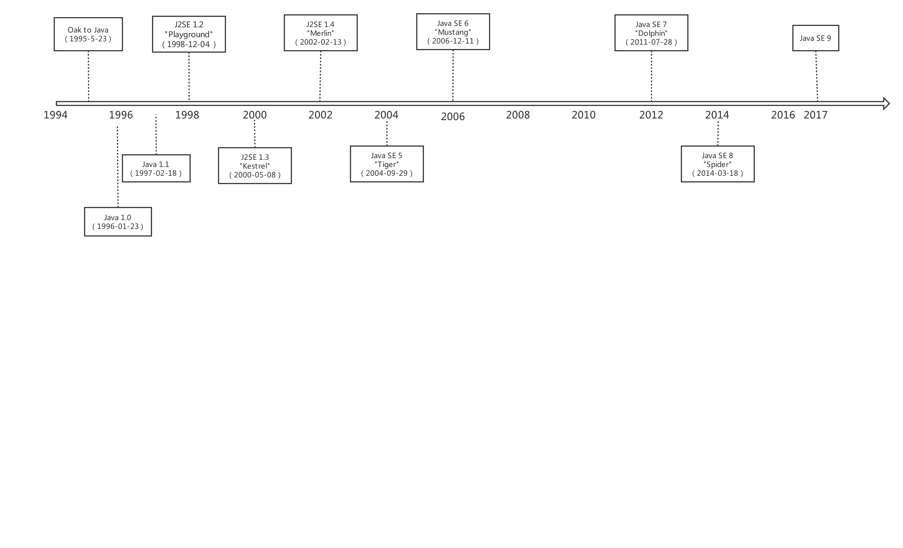

## Java 8的前世今生
这一章主要需要了解Java语言的发展历史。

从第一个Java版本诞生到现在已经有23年的时间了。沧海桑田一瞬间，转眼24年过去了，如今JDK 8以上的版本也开始收费了，JDK 11成为目前长期支持的版本。版本不断变更的这几年，很多企业项目还是在用JDK 8或更低的版本进行维护。但是对于我们开发者来说，始终要不断地学习了解新特性和新技术，否则大浪淘沙，终有一日将成为沙滩上的一条咸鱼。

时间在变，但我们对技术的那份初心永不会变。作为一个Java开发工程师，很有必要来了解一下Java语言发展史。

1995年5月23日，从Oak（橡树）到Java，Java语言第一次提出了"Write Once, Run Anywhere"的口号。

1996年1月23日，Java语言的第一个正式版本的运行环境JDK 1.0发布。

1998年12月4日，JDK的第一个里程碑式的版本JDK 1.2发布，工程代号为Playground（竞技场）。sun公司在这个版本中把Java技术体系拆分为三个方向，分别是面向桌面应用开发的J2SE（Java 2 Platform，Standard Edition）、面向企业级开发的J2EE（Java 2 Platform，Enterprise Edition）和面向手机等移动终端开发的J2ME（Java 2 Platform，Micro Edition）。

2000年5月8日，工程代号为Kestrel（美洲红隼 [sǔn] ）的JDK 1.3发布，它还有一个修正版本JDK 1.3.1，工程代号为Ladybird（瓢虫），于2001年5月17日发布。从这个版本开始，Sun公司维持了一个习惯：大约每隔两年发布一个JDK的主版本，以动物命名，期间发布的各个修正版本则以昆虫作为工程名称。

2002年2月13日，工程代号为Merlin（灰背隼）的JDK 1.4发布。后续还有两个修正版本：2002年9月16日发布的工程代号为Grasshopper（蚱蜢）的JDK 1.4.1和2003年6月26日发布的工程代号为Mantis（螳螂）的JDK 1.4.2。

2004年9月30日，工程代号为Tiger（老虎）的JDK 1.5发布。这个版本的JDK在我看来是Java语言能发展到今天的基石。它提供了自动装箱、泛型、动态注解、枚举、可变长参数、foreach循环和java.util.concurrent并发包等新特性，这些新特性都是Java语言的生命之所在。官方从这个版本开始，在正式文档与宣传上都不再使用类似JDK 1.5的命名，而是使用JDK 5，JDK 6，JDK 7...。只有在程序员内部使用的开发版本号（例如java-version的输出）中才继续沿用1.5，1.6，1.7的版本号。

2006年12月11日，工程代号为Mustang（野马）的JDK 6发布。在这个版本中，Sun公司终结了从JDK 1.2开始已经有8年历史的J2EE、J2SE、J2ME的命名方式，启用Java SE、Java EE、Java ME的命名方式。同年11月13日的JavaOne大会上，Sun公司宣布将Java开源，并建立OpenJDK组织对开源代码进行管理。

2009年2月19日，工程代号为Dolphin（海豚）的JDK 7的第一个版本发布。JDK 7本应是一个包含许多重要改进的版本，JDK 8中的Lambda项目原本计划安排在JDK 7中发布，但由于各种商业原因，Sun公司无力进行JDK 7的研发工作。同年4月20日，Oracle公司收购Sun公司，将很多未实现的改进进行裁剪延期，以保证JDK 7的正式版能够在2011年7月28日准时发布。

2011年7月28日，Oracle公司发布工程代号为Dolphin（海豚）的JDK 7正式版。

2014年3月18日，Oracle公司发布工程代号为Spider（蜘蛛）的JDK 8。

2017年9月21日，Oracle公司发布JDK 9。

## Java 8
Java 8的新特性：
- Lambda表达式
- 流处理StreamAPI
- 默认方法
- 新的日期时间API

后续章节中我们将逐一对这些新特性进行学习。