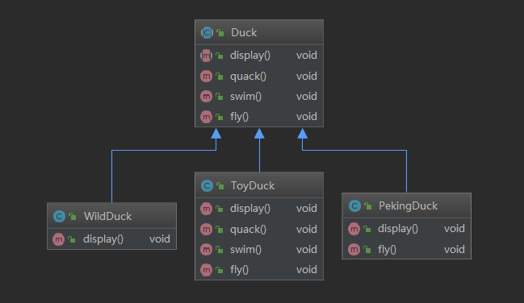
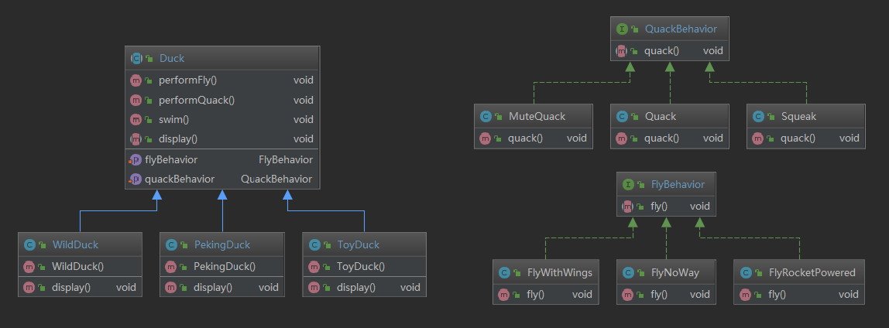

## 模拟鸭子的问题
问题描述：用代码模拟现实中的鸭子，鸭子有很多种类，会发出各种叫声，有的会游泳。

## 传统设计方案
传统方案：使用标准的面向对象设计。设计一个`Duck`超类，让不同种类的鸭子继承该超类。

传统方案的类图设计如下：


代码示例如下：

`Duck`超类：
```
package cn.org.lilu.strategy.traditional;

/**
 * @author: sunchaser
 * @date: 2019/9/15
 * @description: 传统鸭子问题
 *
 * 1. 其它鸭子都继承了Duck类，所以fly方法让所有的子类鸭子都会飞，但并不是所有鸭子都会飞。
 * 2. 实际上这是继承带来的问题，对父类的局部改动，会影响所有子类。称为溢出效应。
 * 3. 为了解决继承带来的问题，我们可以在子类中重写对应的方法来解决。
 * 4. 但是如果有一个玩具鸭类，它需要重写父类所有的方法，这样做的代价有点大。
 */
public abstract class Duck {

    /**
     * 显示鸭子信息的方法
     */
    public abstract void display();

    /**
     * 鸭子叫的方法
     */
    public void quack() {
        System.out.println("鸭子嘎嘎叫");
    }

    /**
     * 鸭子游泳的方法
     */
    public void swim() {
        System.out.println("鸭子会游泳");
    }

    /**
     * 鸭子飞翔的方法
     */
    public void fly() {
        System.out.println("鸭子会飞翔");
    }
}
```

野鸭`WildDuck`类：
```
package cn.org.lilu.strategy.traditional;

/**
 * @author: sunchaser
 * @date: 2019/9/15
 * @description: 野鸭：嘎嘎叫、会游泳和飞翔
 */
public class WildDuck extends Duck {
    @Override
    public void display() {
        System.out.println("这是一只野鸭");
    }
}
```

北京鸭`PekingDuck`类：
```
package cn.org.lilu.strategy.traditional;

/**
 * @author: sunchaser
 * @date: 2019/9/15
 * @description: 北京鸭：不会飞翔
 */
public class PekingDuck extends Duck {
    @Override
    public void display() {
        System.out.println("这是一只北京鸭");
    }

    @Override
    public void fly() {
        System.out.println("北京鸭不会飞翔");
    }
}
```

玩具鸭`ToyDuck`类：
```
package cn.org.lilu.strategy.traditional;

/**
 * @author: sunchaser
 * @date: 2019/9/15
 * @description: 玩具鸭：不会嘎嘎叫、不会游泳和飞翔。
 */
public class ToyDuck extends Duck {
    @Override
    public void display() {
        System.out.println("这是一只玩具鸭");
    }

    @Override
    public void quack() {
        System.out.println("玩具鸭不能叫");
    }

    @Override
    public void swim() {
        System.out.println("玩具鸭不会游泳");
    }

    @Override
    public void fly() {
        System.out.println("玩具鸭不会飞翔");
    }
}
```

超类`Duck`中定义了3个实现方法，一个抽象方法。

子类野鸭WildDuck类会“嘎嘎叫”、“游泳”和“飞翔”。所以野鸭类只需实现抽象方法display即可。

子类北京鸭PekingDuck类不会飞翔，除了实现抽象方法之外还需重写父类的fly方法。

子类玩具鸭ToyDuck类不会叫、不会游泳也不会飞翔。所以玩具鸭类除了实现抽象方法，还要重写父类的三个方法。

这种继承的设计思路似乎没有任何问题。但事实上子类重写父类方法的代价是很高的，一旦出现一个新品种的鸭子，就要去继承`Duck`类，子类默认就有了父类定义好的行为，例如“嘎嘎叫”、“游泳”和“飞翔”。如果子类不满足这些行为就要去重写父类中对应的方法。同时，一旦对父类进行某些局部改动，所有子类都会受到影响。

我们知道Duck类内的fly()和quack()会随着鸭子的不同而改变。事实上每次继承都是在改动这两个方法。

不妨使用策略模式来改造`Duck`类。

> 策略模式定义了算法族，分别封装起来，让它们之间可以互相替换，此模式让算法的变化独立于使用算法的客户。

策略模式中有以下三条设计原则：

- 找出应用中可能需要变化之处，把它们独立出来，不要和那些不需要变化的代码混在一起。
- 针对接口编程，而不是针对实现编程。
- 多用组合，少用继承。

## 分离行为 — 让“煮熟的鸭子”飞起来
是时候将行为从Duck类中分离出来了。将鸭子的行为封装到新的类中，该类专门提供某行为的实现。这样，Duck类就不再需要知道行为的具体实现。

那么如何设计实现“飞翔”和“嘎嘎叫”的行为的类呢？我们希望“煮熟的鸭子飞起来”，鸭子需要经历从生到熟这个过程，我们要做的是在Duck类中增加设定行为的方法，这样就能在“运行时期”动态改变鸭子的行为。

使用了策略模式的类图设计如下：


代码示例如下：

“飞翔”行为接口`FlyBehavior`：
```
package cn.org.lilu.strategy;

/**
 * @author: sunchaser
 * @date: 2019/9/12
 * @description: 飞翔行为接口
 */
public interface FlyBehavior {
    /**
     * 飞翔的方法
     */
    void fly();
}
```

随风飞翔的行为`FlyWithWings`：

```
package cn.org.lilu.strategy.impl;

import FlyBehavior;

/**
 * @author: sunchaser
 * @date: 2019/9/12
 * @description: 可以飞的行为
 */
public class FlyWithWings implements FlyBehavior {
    @Override
    public void fly() {
        System.out.println("fly with wings");
    }
}
```

不能飞的行为`FlyNoWay`：

```
package cn.org.lilu.strategy.impl;

import FlyBehavior;

/**
 * @author: sunchaser
 * @date: 2019/9/12
 * @description: 不能飞的行为
 */
public class FlyNoWay implements FlyBehavior {
    @Override
    public void fly() {
        System.out.println("can't fly");
    }
}
```

利用火箭动力飞翔的行为`FlyRocketPowered`：

```
package cn.org.lilu.strategy.impl;

import FlyBehavior;

/**
 * @author: sunchaser
 * @date: 2019/9/12
 * @description: 利用火箭动力的飞翔行为
 */
public class FlyRocketPowered implements FlyBehavior {
    @Override
    public void fly() {
        System.out.println("fly with rocket");
    }
}
```

“叫”的行为接口`QuackBehavior`：

```
package cn.org.lilu.strategy;

/**
 * @author: sunchaser
 * @date: 2019/9/12
 * @description: 鸭子叫行为接口
 */
public interface QuackBehavior {
    /**
     * 鸭子叫的方法
     */
    void quack();
}
```

嘎嘎叫的行为`Quack`：

```
package cn.org.lilu.strategy.impl;

import QuackBehavior;

/**
 * @author: sunchaser
 * @date: 2019/9/12
 * @description: 嘎嘎叫的行为
 */
public class Quack implements QuackBehavior {
    @Override
    public void quack() {
        System.out.println("Quack 嘎嘎叫");
    }
}
```

吱吱叫的行为`Squeak`：

```
package cn.org.lilu.strategy.impl;

import QuackBehavior;

/**
 * @author: sunchaser
 * @date: 2019/9/12
 * @description: 吱吱叫的行为
 */
public class Squeak implements QuackBehavior {
    @Override
    public void quack() {
        System.out.println("Squeak 吱吱叫");
    }
}
```

不会叫的行为`MuteQuack`：

```
package cn.org.lilu.strategy.impl;

import QuackBehavior;

/**
 * @author: sunchaser
 * @date: 2019/9/12
 * @description: 不会叫的行为
 */
public class MuteQuack implements QuackBehavior {
    @Override
    public void quack() {
        System.out.println("Silence 不会叫");
    }
}
```

分离行为后的`Duck`类：

```
package cn.org.lilu.strategy;

/**
 * @author: sunchaser
 * @date: 2019/9/12
 * @description: 使用策略模式的鸭子类
 */
public abstract class Duck {

    /**
     * 飞翔的行为
     */
    FlyBehavior flyBehavior;

    /**
     * 叫的行为
     */
    QuackBehavior quackBehavior;

    /**
     * 设置飞行行为
     * @param flyBehavior 飞行行为
     */
    public void setFlyBehavior(FlyBehavior flyBehavior) {
        this.flyBehavior = flyBehavior;
    }

    /**
     * 设置叫的行为
     * @param quackBehavior 叫行为
     */
    public void setQuackBehavior(QuackBehavior quackBehavior) {
        this.quackBehavior = quackBehavior;
    }

    /**
     * 使鸭子飞
     */
    public void performFly() {
        if (flyBehavior != null) {
            flyBehavior.fly();
        }
    }

    /**
     * 使鸭子叫
     */
    public void performQuack() {
        if (quackBehavior != null) {
            quackBehavior.quack();
        }
    }

    /**
     * 鸭子游泳的方法
     */
    public void swim() {
        System.out.println("鸭子会游泳");
    }

    /**
     * 显示鸭子信息的方法
     */
    public abstract void display();
}
```

野鸭`WildDuck`类：

```
package cn.org.lilu.strategy;

import FlyWithWings;
import Quack;

/**
 * @author: sunchaser
 * @date: 2019/9/15
 * @description: 野鸭：具有可以飞的行为和嘎嘎叫的行为。
 */
public class WildDuck extends Duck {

    public WildDuck() {
        // 随风飞翔行为
        flyBehavior = new FlyWithWings();
        // 嘎嘎叫行为
        quackBehavior = new Quack();
    }

    @Override
    public void display() {
        System.out.println("这是一只使用策略模式的野鸭");
    }
}
```

北京鸭`PekingDuck`类：

```
package cn.org.lilu.strategy;

import FlyNoWay;
import Squeak;

/**
 * @author: sunchaser
 * @date: 2019/9/15
 * @description: 北京鸭：不能飞翔，吱吱叫
 */
public class PekingDuck extends Duck {

    public PekingDuck() {
        // 不能飞的行为
        flyBehavior = new FlyNoWay();
        // 吱吱叫的行为
        quackBehavior = new Squeak();
    }

    @Override
    public void display() {
        System.out.println("这是一只使用策略模式的北京鸭");
    }
}
```

玩具鸭`ToyDuck`类：

```
package cn.org.lilu.strategy;

import FlyNoWay;
import MuteQuack;

/**
 * @author: sunchaser
 * @date: 2019/9/15
 * @description: 玩具鸭：不会飞也不会叫
 */
public class ToyDuck extends Duck {

    public ToyDuck() {
        // 不会飞的行为
        flyBehavior = new FlyNoWay();
        // 不会叫的行为
        quackBehavior = new MuteQuack();
    }

    @Override
    public void display() {
        System.out.println("这是一只使用策略模式的玩具鸭");
    }
}
```

一切都准备就绪！让我们来见证“煮熟的鸭子”的飞翔吧！
```
package cn.org.lilu.strategy;

import FlyRocketPowered;

/**
 * @author: sunchaser
 * @date: 2019/9/12
 * @description: for test
 */
public class TestStrategy {
    public static void main(String[] args) {
        // 生产一只北京鸭
        Duck duck = new PekingDuck();
        // 让鸭子飞
        duck.performFly();
        // 让鸭子叫
        duck.performQuack();
        // 生产一只玩具鸭
        Duck toyDuck = new ToyDuck();
        // 让鸭子飞：发现不能飞
        toyDuck.performFly();
        // 动态改变行为：让“煮熟的鸭子”飞起来
        toyDuck.setFlyBehavior(new FlyRocketPowered());
        toyDuck.performFly();
    }
}
```

结果：
```
can't fly
Squeak 吱吱叫
can't fly
fly with rocket
```

不管怎样，我们的玩具鸭飞起来了，这里玩具鸭和“煮熟的鸭子”性质上是一样的。

现在我们的`Duck`类不再担心出现新的鸭子种类了。一旦有一个不同行为的新种类鸭，只需要写一个新的行为接口的实现。而不需要对`Duck`类进行修改。这体现了“对修改关闭，对扩展开放”原则，客户端增加行为不用修改原有代码，只要添加一种策略即可，避免了使用多重转移语句(if-else...if-else)。同时策略模式的缺点也由此暴露，每添加一个策略就会产生一个新的类，当策略过多时，类的数量会随之过多。但这至少比使用继承时重写父类方法要好的多。